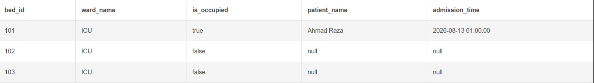

# Hospital Capacity Management System (SQL)

An automated backend database engine designed for real-time hospital resource and bed allocation management using database triggers.

## 🛠️ Key SQL Features
* **PostgreSQL Triggers (`AFTER INSERT`):** Automatically updates bed availability status as soon as a new patient is admitted.
* **Procedural SQL (`PL/pgSQL`):** Built custom database functions to handle business automation rules directly within the database layer.
* **Relational Joins (`LEFT JOIN`):** Live tracking of occupied vs. vacant beds across hospital wards.

## 📊 Live Execution Output
Below is the execution result showing automatic bed occupancy status updates triggered upon patient insertion:

